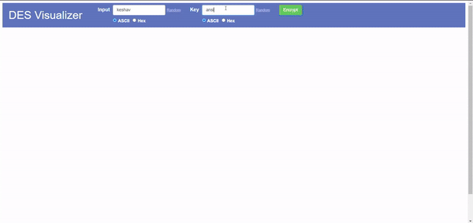

# DES Encryption Algorithm Visualization

## Team Members

- **Keshav Kabra (22BCS052)**
- **Kunal Sharma (22BCS058)**
- **Anish Raja (22BCS012)**
- **Ketan Sharma (22BCS053)**

---

## Overview

The **DES Encryption Algorithm Visualization** is an interactive web application designed to demonstrate the step-by-step working of the Data Encryption Standard (DES) algorithm. This project focuses on simplifying the complex cryptographic operations of DES, including the **Initial Permutation**, **Key Generation**, **16 Rounds of Substitution and Permutation**, and the **Final Permutation** for both encryption and decryption processes.

The visualization is highly intuitive, making it suitable for students, educators, and anyone interested in learning how DES operates.

---




## Features

### **Step-by-Step Visualizations**

- **Initial Permutation**: Demonstrates the bit-level permutation of the input plaintext.
- **Per Round Key Generation**: Explains how 16 unique subkeys are generated from the main key using PC-1, shifts, and PC-2.
- **16 Rounds of DES**: Visualizes each round, including the expansion of the right half, XOR with the round key, S-Box substitution, and P-Box permutation.
- **Final Permutation**: Shows the final reordering of bits to produce the ciphertext.

### **Interactive Interface**

- Input plaintext and keys directly in the browser.
- Step through the encryption or decryption process at your own pace.
- Hover over or click elements for detailed explanations.

### **Educational Design**

- Highlights key transformations and intermediate states to enhance understanding.
- Clear diagrams and tooltips for every operation.

---

## Technology Stack

- **Frontend**: HTML5, CSS3, JavaScript
- **Deployment**: [Vercel](https://vercel.com)

---

## Usage

Access the application: Visit the deployed version on Vercel.
Input Details: Provide plaintext and a key to visualize the encryption process.
Step Through the Algorithm: Use the interactive controls to navigate through the DES steps.
Switch Modes: Toggle between encryption and decryption to observe the full DES cycle.

## Progress

The project is fully deployed on Vercel and provides a complete visualization of the DES algorithm. Future improvements include:

Adding support for additional encryption algorithms (e.g., AES).
Enhancing mobile responsiveness for better usability across devices.
Providing export options for step-by-step walkthrough reports.

## Conclusion

The DES Encryption Algorithm Visualization is an educational tool designed to bridge the gap between theoretical concepts and practical understanding. By breaking down each step of the DES process, we aim to make cryptographic principles accessible to a broader audience.

Start exploring the fascinating world of encryption with our tool today!

## Project Structure

```plaintext
/des-visualizer
├── /src
│   ├── index.html       # Main HTML file
│   ├── styles.css       # Styling for the visualization
│   ├── script.js        # Core JavaScript logic for DES
│   └── assets/          # Images, icons, or additional resources
├── /docs                # Documentation and user guides
└── README.md            # Project README

```
